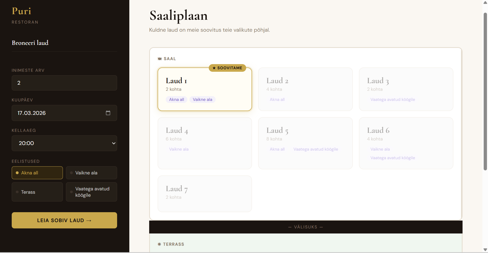

# Restaurant Puri – Table Reservation Web Application
A table reservation system for Restaurant Puri.

## Description
A web application that allows customers to search and reserve 
restaurant tables based on group size, date, time, and seating preferences.
On startup, up to 3 random reservations are generated per table within the next 7 days,
with no overlapping time slots. Each reservation lasts 2 hours.

## Screenshot

## Table Selection Logic
When selecting the best available table, the system uses the following priority order:
1. Tables where all requested features match
2. Tables where some of the requested features match
3. If no feature match is found, the best fitting table by group size is offered

## Technologies
- Java 21
- Gradle
- Spring Web
- Lombok
- Spring Data JPA
- H2 Database
- Thymeleaf
- Spring Boot DevTools

## Features
- Search for available tables by date, time and group size
- Filter tables by seating preferences (window seat, quiet area, terrace, open kitchen view)
- Visual floor plan divided into indoor and terrace seating zones
- Smart table recommendation highlighted in gold based on best feature and size match
- Booking confirmation modal asking for customer name and email
- Past dates are blocked in the date picker
- Random test reservations generated on startup to simulate a realistic environment

## How to Run
1. Clone the repository
2. Open the project in a Java IDE
3. Run `TableReservationApplication.java`
4. Open your browser and go to `http://localhost:8080`

## Work Process
The project was developed over approximately five days, with steady progress made each day.
The initial stages required more time as I familiarised myself with the technology stack,
but development became smoother as the project progressed.

The most challenging aspect was connecting the HTML templates with the Java backend.
For guidance and support throughout the project, I used Claude AI, which also assisted
with the HTML styling. JavaScript solutions were adapted from GeeksforGeeks and Claude AI.

## Author
Greete Siemann
